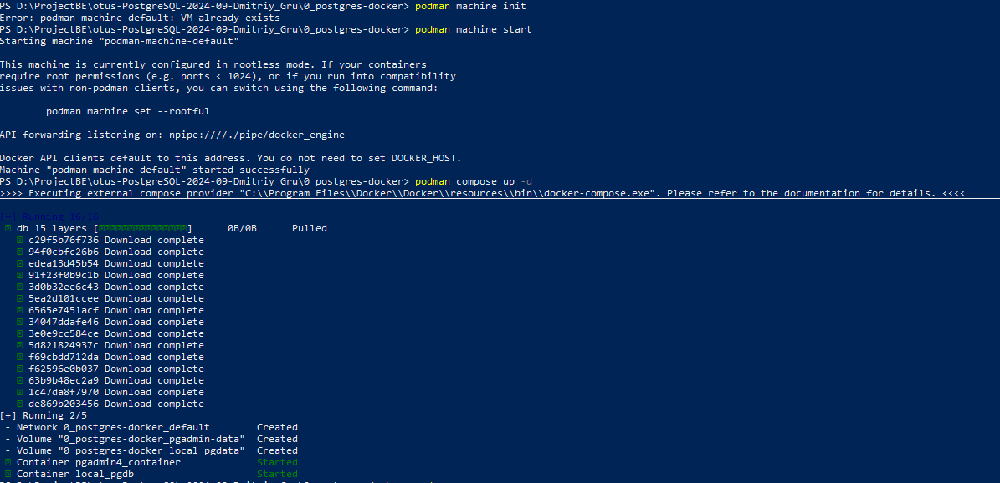
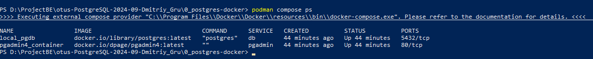
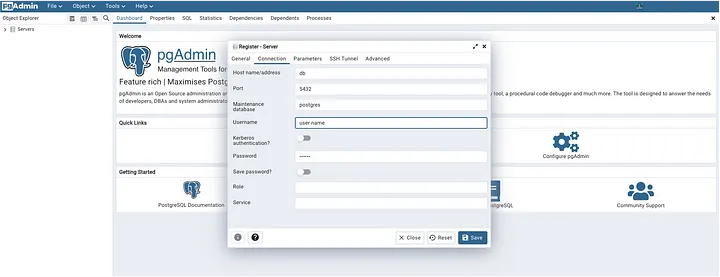

### Запустить PostgreSQL и PGAdmin с помощью docker compose
Запуск PostgreSQL на родной операционной системе всегда является проблемой. Сначала нам нужно выполнить установку на соответствующей операционной системе, будь то Linux, Windows или MacOS. Процедура установки различается от ОС к ОС.

Мы будем использовать Docker (точнее, docker compose) для развертывания PostgreSQL вместе с PGAdmin в локальной среде.

После установки Docker на локальном компьютере установка будет запущена независимо от типа операционной системы.

### Процесс выполнения
1. Создайте каталог и файл docker-compose.yml внутри каталога.
2. В каждой сессий запущена команда
```bash
mkdir postgres-docker 
cd postgres-docker
```
3. Содержимое файла docker-compose.yml следующее
```bash
version: "3.8"
services:
  db:
    image: postgres
    container_name: local_pgdb
    restart: always
    ports:
      - "5432:5432"
    environment:
      POSTGRES_USER: user-name
      POSTGRES_PASSWORD: strong-password
    volumes:
      - local_pgdata:/var/lib/postgresql/data
  pgadmin:
    image: dpage/pgadmin4
    container_name: pgadmin4_container
    restart: always
    ports:
      - "8888:80"
    environment:
      PGADMIN_DEFAULT_EMAIL: user-name@domain-name.com
      PGADMIN_DEFAULT_PASSWORD: strong-password
    volumes:
      - pgadmin-data:/var/lib/pgadmin

volumes:
  local_pgdata:
  pgadmin-data:
```
4. При желании вы можете изменить следующие значения
```bash
services:
  db:
    ports:
      - "5432:5432"
    environment:
      POSTGRES_USER: user-name
      POSTGRES_PASSWORD: strong-password
  pgadmin:
    ports:
      - "8888:80"
    environment:
      PGADMIN_DEFAULT_EMAIL: user-name@domain-name.com
      PGADMIN_DEFAULT_PASSWORD: strong-password
```
5. При желании вы можете изменить следующие значения
```bash
docker-compose up -d

# В последней версии Docker вам может потребоваться запустить

docker compose up -d
```

6. Проверьте состояние работы контейнера Docker
```bash
docker-compose ps
# В последней версии Docker вам может потребоваться запустить
docker compose ps
```


7. Теперь используйте инструмент PGAdmin, откройте браузер и перейдите по адресу http://localhost:8888/ . 
8. Введите имя пользователя и пароль для PGAdmin.
9. Теперь подключитесь к базе данных PostgreSQL, используя учетные данные БД.

